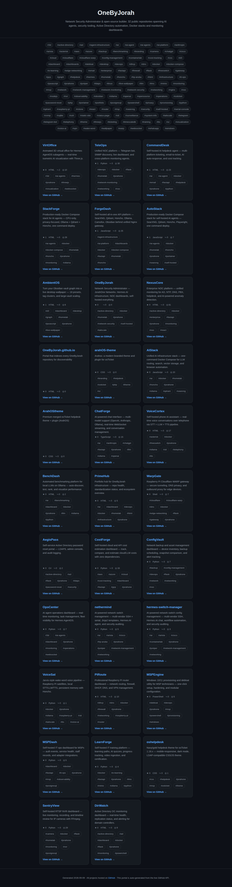
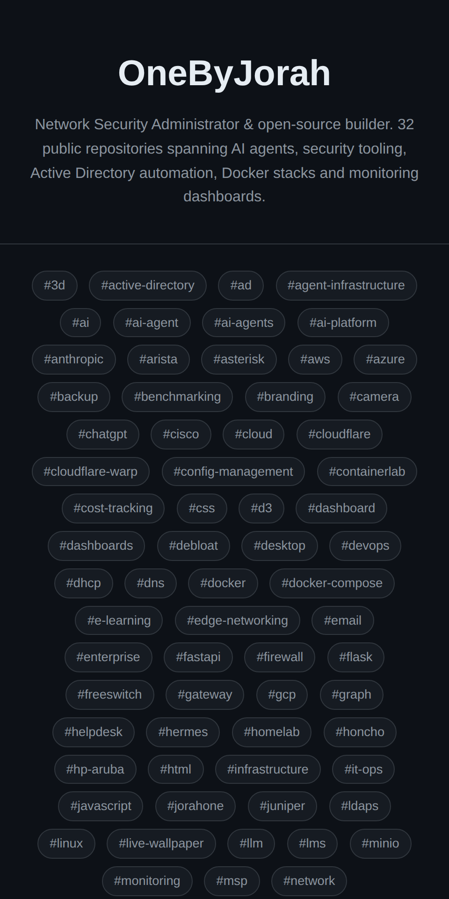

<div align="center">


# OneByJorah.github.io

**The portal that indexes every OneByJorah repository** — auto-generated from the live GitHub API and published with GitHub Pages.

<a href="https://github.com/OneByJorah/OneByJorah.github.io/stargazers"></a>
<a href="https://github.com/OneByJorah/OneByJorah.github.io/commits"></a>


</div>


## What This Is

This repository hosts [onebyjorah.github.io](https://onebyjorah.github.io), a static portal that lists every public, non-fork OneByJorah project with its description, language, stars, forks, open issues, and topics. A Python generator pulls live GitHub API data and rebuilds the site on a weekly schedule, so the index never goes stale by hand.

## Quick Start

```bash
git clone https://github.com/OneByJorah/OneByJorah.github.io.git
cd OneByJorah.github.io
python3 gen.py
```

This regenerates `index.html`, `sitemap.xml`, and `robots.txt` in place. Preview locally with `python3 -m http.server 8000` and open **http://localhost:8000**.

> [!NOTE]
> `gen.py` calls the public GitHub API unauthenticated. To avoid rate limits locally, set a `GITHUB_TOKEN` environment variable — the workflow uses the built-in Actions token.

## Features

- **Live repository data** — stars, forks, language, topics, and open issues from the GitHub API.
- **Automatic updates** — GitHub Actions regenerates the portal every Monday at 06:17 UTC.
- **Topic discovery** — a floating tag cloud links related projects (e.g. `#ai`, `#docker`, `#security`).
- **SEO ready** — JSON-LD structured data and an XML sitemap.
- **Fast indexing** — the workflow pings IndexNow after each build.
- **Responsive** — works across desktop, tablet, and mobile.
- **Zero runtime** — pure static output served by GitHub Pages.

## Architecture

```
┌─────────────────┐     ┌─────────────────┐     ┌─────────────────┐
│  GitHub API     │────▶│   gen.py        │────▶│ GitHub Pages    │
│  (Live Data)    │     │  (Python Script)│     │  (Static Site)  │
└─────────────────┘     └─────────────────┘     └─────────────────┘
                                ▲
                                │
                    ┌─────────────────┐
                    │ GitHub Actions  │
                    │ (weekly cron)   │
                    └─────────────────┘
```

### Components

1. **`gen.py`** — fetches repositories, filters out forks/private repos, sorts by stars and recency, then writes `index.html`, `sitemap.xml`, and `robots.txt`.
2. **`update-portal.yml`** — GitHub Actions workflow running on a weekly cron (`17 6 * * 1`), manual dispatch, or pushes to `gen.py`; commits changes and pings IndexNow.
3. **GitHub Pages** — hosts the generated static site.

## Generated Output

| File | Purpose |
|------|---------|
| `index.html` | Portal page with project cards and topic cloud |
| `sitemap.xml` | XML sitemap for search engines |
| `robots.txt` | Robots exclusion directives |
| `*.txt` | IndexNow key file |

## Project Structure

```
OneByJorah.github.io/
├── gen.py                          # Portal generator (GitHub API → static site)
├── index.html                      # Generated portal page
├── sitemap.xml                     # Generated sitemap
├── robots.txt                      # Generated robots directives
├── key.txt                         # IndexNow key
├── .nojekyll                       # Disable Jekyll processing
├── .github/workflows/update-portal.yml
├── docs/assets/                    # Banner, screenshots
└── README.md
```

## Configuration

| Variable | Default | Description |
|----------|---------|-------------|
| `GITHUB_TOKEN` | — | Optional token for higher API rate limits during local runs |

## Use Cases

1. **Public index** — a single URL that lists everything OneByJorah has published.
2. **Discovery** — browse projects by topic instead of scrolling an org page.
3. **SEO surface** — structured data and a sitemap for search engines.

## Tech Stack

Python 3.11+ · GitHub REST API · HTML5 · CSS · JavaScript · GitHub Pages · GitHub Actions · IndexNow

## Screenshots

| View | |
|---|---|
|  |  |

## Contributing

Issues and improvements are welcome. [Open an issue](https://github.com/OneByJorah/OneByJorah.github.io/issues) or see the [OneByJorah org](https://github.com/OneByJorah).

## License

This portal is part of the OneByJorah organization and has no separate license file. Each linked project carries its own license, available on its repository.

## Connect

- [jorahone.com](https://jorahone.com)
- [GitHub Org](https://github.com/OneByJorah)
- [info@jorahone.com](mailto:info@jorahone.com)
