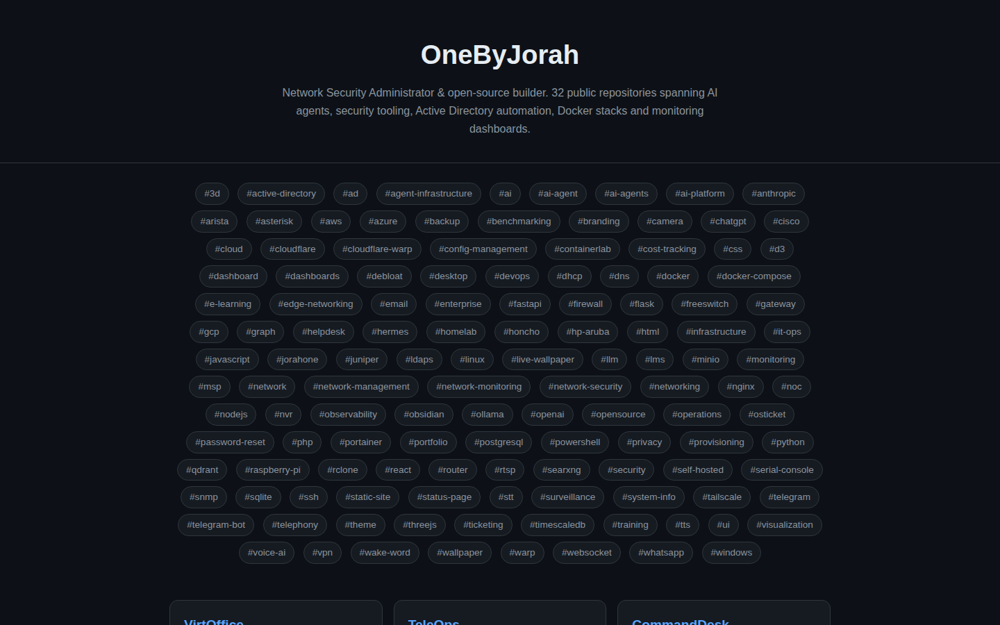
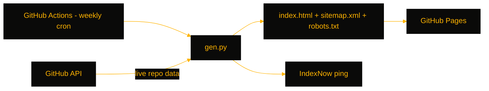

# OneByJorah.github.io

> GitHub Pages portal that indexes every public OneByJorah repository — auto-generated from the live GitHub API on a weekly cron, so the project index never goes stale.

[](https://github.com/OneByJorah/OneByJorah.github.io)
[](https://github.com/OneByJorah/OneByJorah.github.io)
[](https://github.com/OneByJorah/OneByJorah.github.io/stargazers)
[](https://github.com/OneByJorah/OneByJorah.github.io/commits)



## What This Is

This repo powers [onebyjorah.github.io](https://onebyjorah.github.io), a static portal listing every public, non-fork OneByJorah project with its description, language, stars, forks, open issues, and topics. A Python generator pulls live GitHub API data and rebuilds the site on schedule. Built for anyone who wants a single URL that shows everything the org ships.

## Quick Start

```bash
git clone https://github.com/OneByJorah/OneByJorah.github.io.git
cd OneByJorah.github.io
python3 gen.py
```

Regenerates `index.html`, `sitemap.xml`, and `robots.txt` in place. Preview with `python3 -m http.server 8000`.

## Features

- Live repo data from the GitHub API — stars, forks, language, topics, open issues
- Weekly auto-regeneration via GitHub Actions (Monday 06:17 UTC, plus manual dispatch)
- Topic tag cloud linking related projects
- JSON-LD structured data and XML sitemap for search engines
- IndexNow ping after each build for fast indexing
- Zero-runtime static output served by GitHub Pages

## Architecture



`gen.py` calls the public API unauthenticated; set `GITHUB_TOKEN` locally to raise rate limits.

## Stack

Python 3.11+, GitHub REST API, HTML5, CSS, JavaScript, GitHub Pages, GitHub Actions, IndexNow

## Contributing

Issues and improvements are welcome — [open an issue](https://github.com/OneByJorah/OneByJorah.github.io/issues).

## License

MIT — see [LICENSE](LICENSE).
